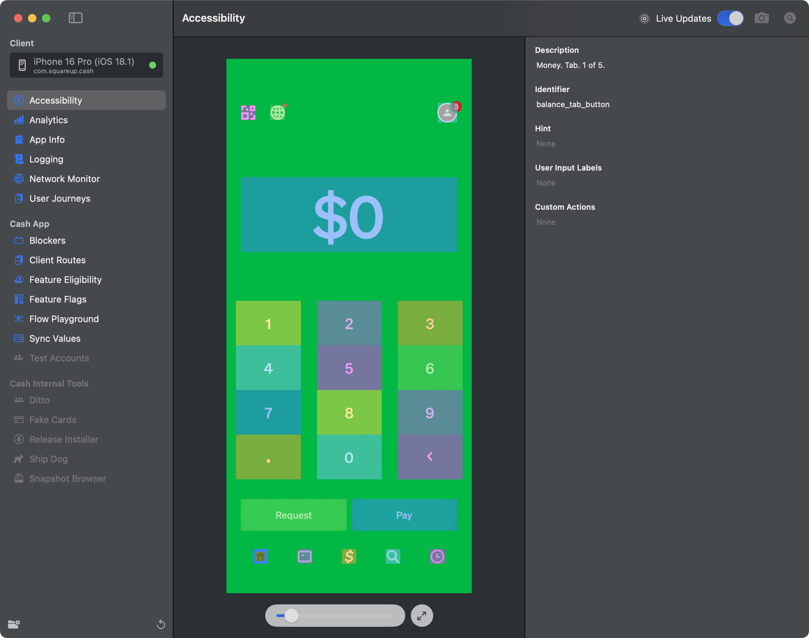

# AccessibilityDesktopPlugin

The AccessibilityDesktopPlugin is a powerful debugging tool that helps developers inspect and verify accessibility implementations in mobile applications. It provides a visual interface for examining accessibility elements, their properties, and how they interact with assistive technologies.

## Features

### 1. Live View and Snapshot Capabilities
- **Live Updates Toggle**: Enable/disable continuous snapshots during simulator interactions
- **Manual Snapshot**: Capture the current screen state on demand
- **Quick Access to Accessibility Inspector**: Launch Apple's Accessibility Inspector directly from the plugin

### 2. Interactive Visual Interface
- **Split View Layout**: 
  - Left panel: Interactive snapshot view
  - Right panel: Detailed accessibility information
- **Zoom and Pan Controls**:
  - Interactive slider for precise zoom control (25% to 1000%)
  - Reset view button to return to default view
  - Visual scale percentage indicator
  - Pan capability for navigating zoomed content

### 3. Element Inspection
Visual overlay system that displays:
- Color-coded element boundaries
- Interactive highlight on hover
- Selection state for focused elements
- Visual indicators for accessibility boundaries

### 4. Detailed Element Information
When selecting an accessibility element, view detailed properties including:
- **Description**: The VoiceOver description for the element
- **Identifier**: Accessibility identifier used for UI testing
- **Hint**: Additional VoiceOver hints
- **User Input Labels**: Voice Control input labels
- **Custom Actions**: Available custom accessibility actions

### 5. Visual Debugging
- Color-coded overlays to distinguish different accessibility elements
- Interactive selection of elements
- Visual feedback for element boundaries and selection states
- Clear visualization of element hierarchies

## Usage

1. Connect to your running application
2. Toggle "Live Updates" to see real-time changes or use the camera button to take manual snapshots
3. Use the zoom slider and pan controls to navigate the interface
4. Click on highlighted elements to inspect their accessibility properties
5. Use the Accessibility Inspector button to launch Apple's built-in inspector for additional debugging

## Integration with Apple's Tools
Direct integration with Apple's Accessibility Inspector for advanced debugging capabilities and seamless workflow integration.
